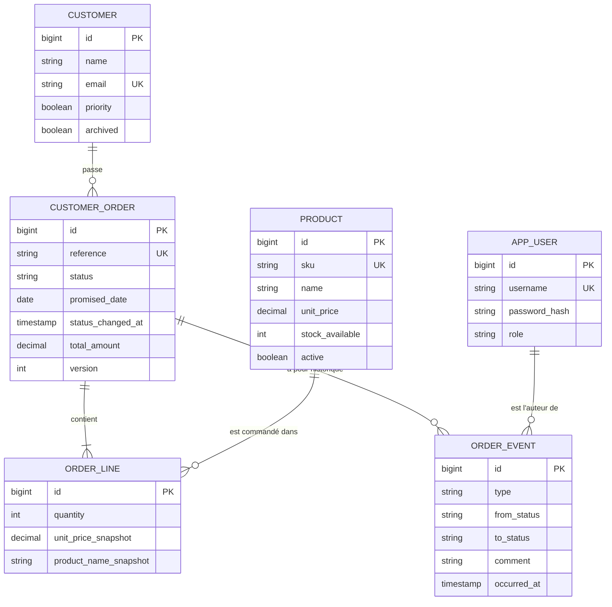

# Modèle de données (cible du MVP)

Les tables sont créées progressivement par les migrations Flyway (J2 à J8). `order` étant un mot réservé SQL, la table s'appelle `customer_order`.

```mermaid
erDiagram
    CUSTOMER ||--o{ CUSTOMER_ORDER : passe
    CUSTOMER_ORDER ||--|{ ORDER_LINE : contient
    PRODUCT ||--o{ ORDER_LINE : "est commandé dans"
    CUSTOMER_ORDER ||--o{ ORDER_EVENT : "a pour historique"
    APP_USER ||--o{ ORDER_EVENT : "est l'auteur de"

    CUSTOMER {
      bigint id PK
      string name
      string email UK
      boolean priority
      boolean archived
    }
    PRODUCT {
      bigint id PK
      string sku UK
      string name
      decimal unit_price
      int stock_available
      boolean active
    }
    CUSTOMER_ORDER {
      bigint id PK
      string reference UK
      string status
      date promised_date
      timestamp status_changed_at
      decimal total_amount
      int version
    }
    ORDER_LINE {
      bigint id PK
      int quantity
      decimal unit_price_snapshot
      string product_name_snapshot
    }
    ORDER_EVENT {
      bigint id PK
      string type
      string from_status
      string to_status
      string comment
      timestamp occurred_at
    }
    APP_USER {
      bigint id PK
      string username UK
      string password_hash
      string role
    }
```
