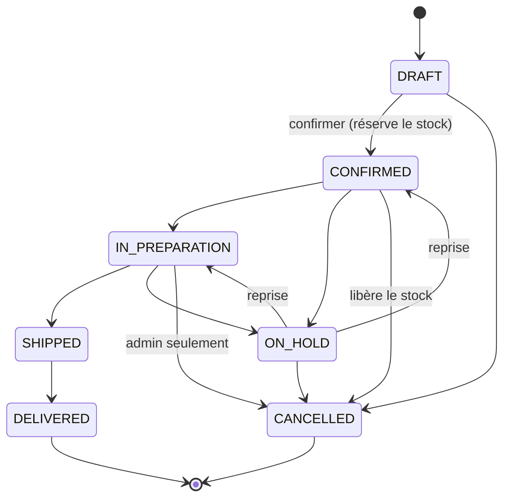

# Cycle de vie d'une commande

```mermaid
stateDiagram-v2
    [*] --> DRAFT
    DRAFT --> CONFIRMED : confirmer (réserve le stock)
    DRAFT --> CANCELLED
    CONFIRMED --> IN_PREPARATION
    CONFIRMED --> ON_HOLD
    CONFIRMED --> CANCELLED : libère le stock
    IN_PREPARATION --> SHIPPED
    IN_PREPARATION --> ON_HOLD
    IN_PREPARATION --> CANCELLED : admin seulement
    ON_HOLD --> CONFIRMED : reprise
    ON_HOLD --> IN_PREPARATION : reprise
    ON_HOLD --> CANCELLED
    SHIPPED --> DELIVERED
    DELIVERED --> [*]
    CANCELLED --> [*]
```

`DELIVERED` et `CANCELLED` sont des états **terminaux** : plus aucune transition n'est possible.
